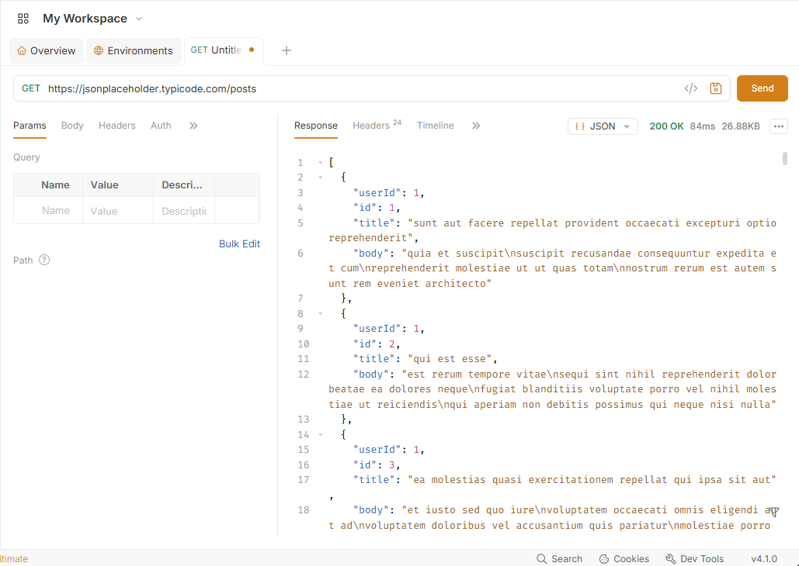
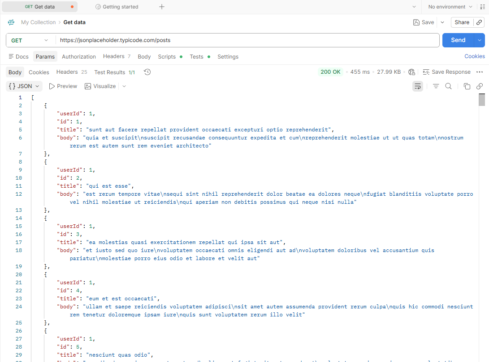
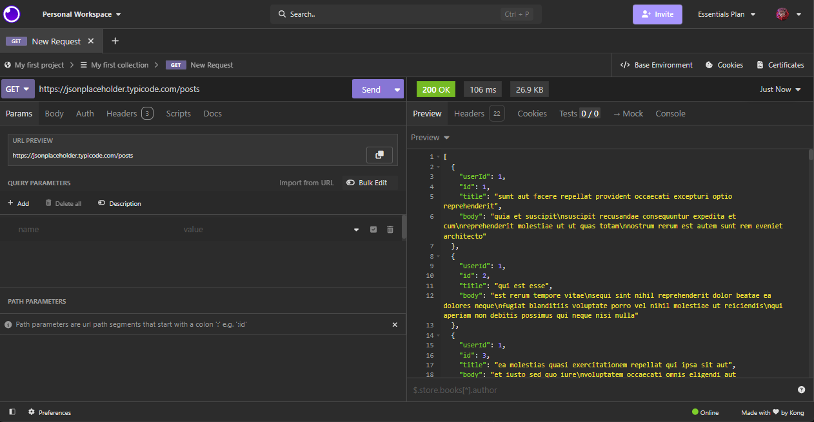

# HTTP Comprendre le HTTP

Projet réalisé dans le cadre d'un exercice sur les requêtes HTTP.

## Objectif

Le projet prend la forme d'un jeu de piste permettant de découvrir progressivement le fonctionnement d'une API et des différentes méthodes HTTP.

Les requêtes sont enregistrées dans plusieurs fichiers `.yml`.

## Méthodes HTTP utilisées

Le projet permet de manipuler plusieurs méthodes :

* `GET` : récupérer des informations
* `POST` : envoyer ou créer des données
* `PUT` : modifier ou remplacer des données
* `DELETE` : supprimer une ressource
* `PATCH` : modifier une partie d'une ressource

## Contenu

Le jeu de piste est composé d'une introduction suivie de plusieurs étapes :

```text
Jeu de piste étape intro.yml
Jeu de piste étape 1.yml
Jeu de piste étape 2.yml
Jeu de piste étape 3.yml
Jeu de piste étape 4.yml
Jeu de piste étape 5.yml
Jeu de piste étape 6.yml
Jeu de piste étape 7.yml
opencollection.yml
```

Chaque fichier contient une requête HTTP permettant d'avancer dans le jeu de piste.

## Jeu de piste HTTP

### Introduction

Le but de ce jeu de piste est de découvrir progressivement le fonctionnement des requêtes HTTP.

Au cours des différentes étapes, plusieurs méthodes HTTP sont utilisées :

- `GET`
- `POST`
- `PUT`
- `DELETE`
- `PATCH`

On découvre également l'utilisation :

- des paramètres dans une URL ;
- des headers ;
- du format JSON ;
- du Body d'une requête ;
- d'une clé API ;
- du User-Agent.

---

### Étape d'introduction

#### Méthode utilisée

`GET`

#### URL

```text
172.16.3.254:8001/bienvenue
```

#### Explication

On utilise une requête `GET`, qui sert principalement à demander et récupérer des informations depuis un serveur.

---

### Étape 1 : Utiliser un paramètre

#### Méthode utilisée

`GET`

#### URL

```text
172.16.3.254:8001/decouverte-des-parametres?nom=Jeffredo
```

#### Paramètre envoyé

```text
nom = Jeffredo
```

#### Explication

Dans cette étape, on utilise toujours la méthode `GET`.

Le paramètre est :

```text
nom=Jeffredo
```

Le caractère `?` permet de commencer la partie contenant les paramètres.

On envoie donc au serveur une information appelée `nom` avec la valeur `Jeffredo`.

---

### Étape 2 : Utiliser plusieurs paramètres

#### Méthode utilisée

`GET`

#### URL

```text
172.16.3.254:8001/plusieurs-parametres?prenom=Joshua&age=20
```

#### Paramètres envoyés

```text
prenom = Joshua
age = 20
```

#### Explication

Cette étape reprend le principe de l'étape précédente, mais avec plusieurs paramètres.

Le premier paramètre est :

```text
prenom=Joshua
```

Le deuxième paramètre est :

```text
age=20
```

Le caractère `&` permet de séparer plusieurs paramètres dans une URL.

On obtient donc :

```text
?prenom=Joshua&age=20
```

---

### Étape 3 : Utiliser POST et JSON

#### Méthode utilisée

`POST`

#### URL

```text
172.16.3.254:8001/5-content-type
```

#### Type de Body

```text
JSON
```

#### Explication

Dans cette étape, on utilise la méthode `POST`.

Contrairement à `GET`, la méthode `POST` permet notamment d'envoyer des données au serveur dans le corps de la requête, appelé le `Body`.

Le Body est configuré au format :

```text
JSON
```

---

### Étape 4 : Utiliser PUT et les Headers

#### Méthode utilisée

`PUT`

#### URL

```text
172.16.3.254:8001/put-method-6
```

#### Headers utilisés

```text
Content-Type: text/html
Accept: application/json
```

#### Explication

Dans cette étape, on utilise la méthode `PUT`.

On ajoute également des `headers` à la requête.

Le premier header est :

```text
Content-Type: text/html
```

Le deuxième header est :

```text
Accept: application/json
```

Il indique que l'on souhaite recevoir une réponse au format JSON.

---

### Étape 5 : Utiliser DELETE

#### Méthode utilisée

`DELETE`

#### URL

```text
172.16.3.254:8001/et-oui-delete?filename=test.txt
```

#### Paramètre envoyé

```text
filename = test.txt
```

#### Explication

Dans cette étape, on utilise la méthode `DELETE`.

Cette méthode permet de demander la suppression d'une ressource sur un serveur.

On transmet également le paramètre :

```text
filename=test.txt
```

Cela indique au serveur que la ressource concernée est le fichier :

```text
test.txt
```

---

### Étape 6 : Utiliser PATCH

#### Méthode utilisée

`PATCH`

#### URL

```text
172.16.3.254:8001/etape8/api/users/12345
```

#### Header utilisé

```text
Content-Type: application/json
```

#### Body

```json
{
    "role": "Developer",
    "email": "bdhzdhjq@gmail.com"
}
```

#### Explication

Dans cette étape, j'utilise la méthode `PATCH`.

L'URL contient également :

```text
12345
```

Le Body contient deux nouvelles informations :

```text
role = Developer
email = bdhzdhjq@gmail.com
```

Le header :

```text
Content-Type: application/json
```

---

### Étape 7 : Utiliser une clé API et un User-Agent

#### Méthode utilisée

`POST`

#### URL

```text
172.16.3.254:8001/etape9/
```

#### Headers utilisés

```text
Content-Type: application/json
api-key: FenelonBTSSIO
User-Agent: FenelonBTSSIO-UserAgent-LaRochelle-v1.0
```

#### Body

```json
{
    "name": "Donald Duck"
}
```

#### Explication

Cette dernière étape utilise une requête `POST`.

On utilise plusieurs headers.

Le premier :

```text
Content-Type: application/json
```


Le deuxième :

```text
api-key: FenelonBTSSIO
```

permet d'envoyer une clé API au serveur.

Le troisième header est :

```text
User-Agent: FenelonBTSSIO-UserAgent-LaRochelle-v1.0
```

Il permet d'indiquer au serveur l'identité du client qui effectue la requête.

Enfin, le Body contient :

```json
{
    "name": "Donald Duck"
}
```


## Notions abordées

Au cours des différentes étapes, le projet utilise notamment :

* les paramètres d'URL
* les paramètres de requête
* les données JSON
* les headers HTTP
* le `Content-Type`
* les clés API
* les différentes méthodes HTTP

## API

Les exercices communiquent avec une API disponible sur le réseau local :

```text
172.16.3.254:8001
```


L'accès à cette API peut donc nécessiter d'être connecté au réseau prévu pour le TP.
Réalisé par Chatgpt avec le prompt suivant : "si je t'envoie tout ça est-ce que tu peux me faire un readme simple ?"

## BRUNO

J'ai installé Bruno "https://www.usebruno.com/" <br>
et j'ai mis la clé API donné dans le tp : "https://jsonplaceholder.typicode.com/posts" <br>
puis avec un **GET** pour récupérer les information du serveur ce qui m'a donné ceci : 

Pour répondre aux questions suivante : 
- Comment est affichée la réponse ?
**La réponse s’affiche à droite de l’écran, dans la partie Response, ici au format JSON.**
- Comment sauvegarder la requête ?<br>
**On peut sauvegarder la requête avec Ctrl + S ou avec l’option d’enregistrement de Bruno. La requête est enregistrée dans la collection.**
- Comment organiser les requêtes (dossiers/collections) ?<br>
**Les requêtes peuvent être regroupées dans des collections puis rangées dans des dossiers pour mieux les organiser.**

## POSTMAN

J'ai utilisé POSTMAN sur navigateur "https://web.postman.co/"<br>
et j'ai mis la clé API donné dans le tp "https://jsonplaceholder.typicode.com/posts"<br>
puis avec un **GET** pour récupérer les informations du serveur ce qui m'a donné ceci : 

Pour répondre aux questions suivante : 
- Comment est affichée la réponse ?<br>
**La réponse s’affiche dans la partie basse de Postman, dans l’onglet Body ici au format JSON.**
- Comment sauvegarder la requête ?
**On peut sauvegarder la requête en cliquant sur le bouton Save en haut à droite.**
- Comment organiser les requêtes (dossiers/collections) ?
**Les requêtes peuvent être rangées dans des Collections puis classées dans des dossiers à l’intérieur de ces collections.**

## INSOMNIA

J'ai installé INSOMNIA "https://app.insomnia.rest/" <br>
et j'ai mis la clé API donné dans le tp : "https://jsonplaceholder.typicode.com/posts" <br>
puis avec un **GET** pour récupérer les information du serveur ce qui m'a donné ceci : 

Pour répondre aux questions suivante : 
- Comment est affichée la réponse ?<br>
**La réponse s’affiche à droite de l’écran, dans l’onglet Preview, ici au format JSON.**
- Comment sauvegarder la requête ?<br>
**Insomnia enregistre automatiquement les modifications de la requête.**
- Comment organiser les requêtes (dossiers/collections) ?<br>
**Les requêtes peuvent être regroupées dans des collections et rangées dans des dossiers pour mieux les organiser.**
